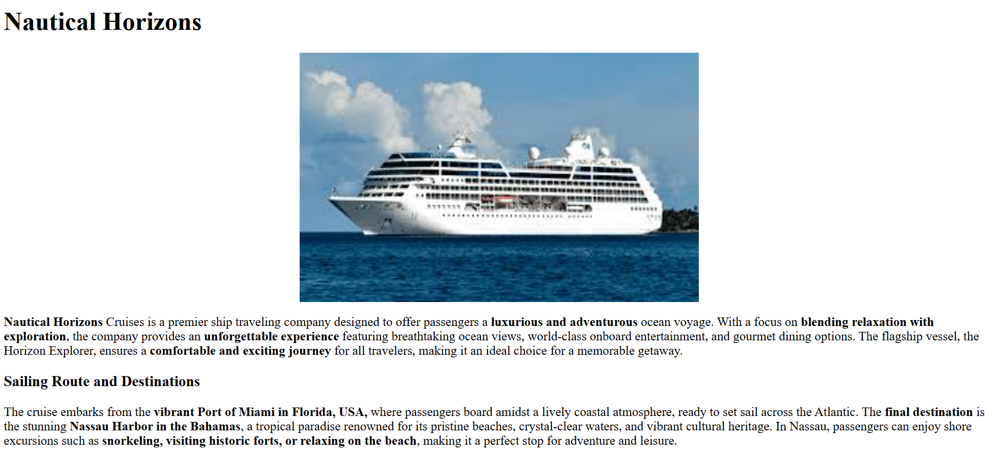
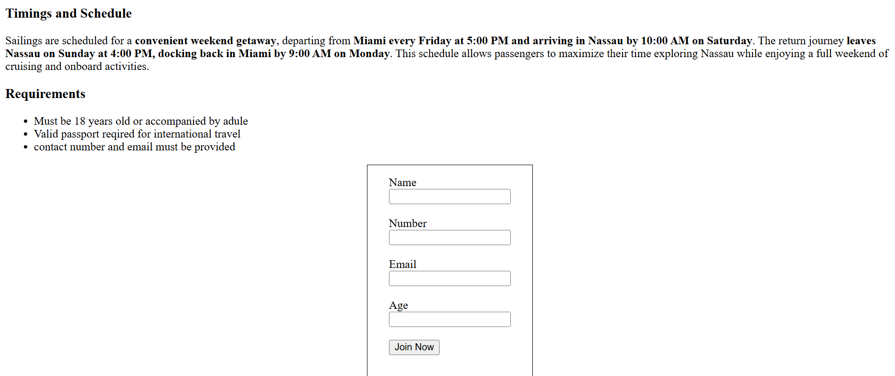

Cruise Web Page

A simple and responsive web page project created using HTML5 and CSS3. The project demonstrates basic front-end development skills including layout design, text formatting, images, and form handling.

Features

Clean and minimal design
1.Centered form with input fields (Name, Email, Age, Number)
2.Button functionality (Join Now)
3.Structured layout with paragraphs and images

Tech Stack
1.HTML5
2.CSS3

How to Run
1. Clone this repository
2. Open index.html in your browser

Preview

<table>
  <tr>
    <td></td>
    <td></td>
  </tr>
  <tr>
    <td align="center">Output 1</td>
    <td align="center">Output 2</td>
  </tr>
</table>
